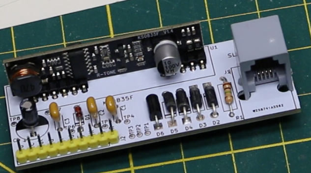

# KS0835F_Phone_SLIC

KS0835F phone line SLIC module breakout PCB

[]

This PCB includes the recommended support circuitry for the subscriber line interface and provides an RJ phone jack, and a header for providing power, control I/O, and audio in/out.

## Interactive BOM

[Interactive Bill Of Material, BOM](https://matsk.github.io/KS0835F_Phone_SLIC/ibom.html)

The RJ phone jack used on this PCB is from AliExpress and uses this footprint.

[}
